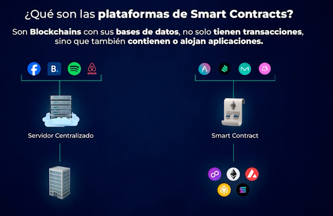

# Tipos de Ecosistemas

## Compatibles con EVM y no compatibles con EVM

En Web 3 las aplicaciones viven en blockchains y el valor retorna a los usuarios. Como en sistemas operativos
tradicionales (Windows, Mac, Linux), existen distintas plataformas de smart contracts que se dividen en dos tipos:
compatibles con EVM y no compatibles. Las compatibles con EVM (Binance Smart Chain, Polygon, Sonic, etc.) usan la misma
tecnologia para ejecutar aplicaciones y lenguajes que la EVM entiende, principalmente Solidity. Las no compatibles
(Solana, Sui, Polkadot, etc.) tienen tecnologia distinta y sus maquinas virtuales hablan otro idioma, requiriendo
traduccion de las aplicaciones.

## Plataformas especificas

Son redes de infraestructura fisicas descentralizadas o **DePIN**. Aunque tambien tienen nodos, base de datos y
algoritmos de consenso, se usan para algo concreto. Por ejemplo, Filecoin (FIL) es una blockchain para almacenar datos
(como un Google Drive descentralizado) donde pagas el espacio con FIL.

Las redes compatibles con EVM **utilizan la misma wallet**. Las no compatibles utilizan distintas wallets.

## Conclusion

Las plataformas de smart contracts funcionan como sistemas operativos para interactuar con dapps, crear productos de
inversion e invertir en este ecosistema Web 3. Como este nuevo internet retorna valor al usuario, entrar hoy es como
comprar internet en el año 2000. Al comprar ETH, compramos un pedazo de ese nuevo internet: si se crean mas aplicaciones
en Ethereum, su base vale mas. Mientras mas se use Ethereum, mas vale Ether porque es la moneda para pagar dentro del
ecosistema. Para activar smart contracts en esta red descentralizada se paga una comision a los nodos validadores
llamada **Gas**.