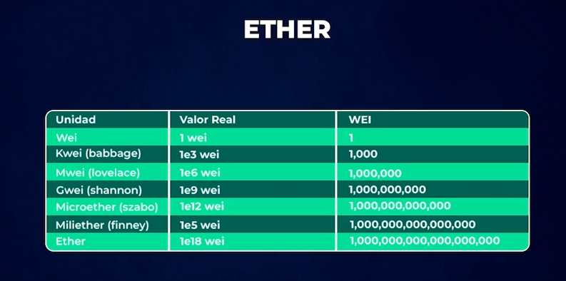
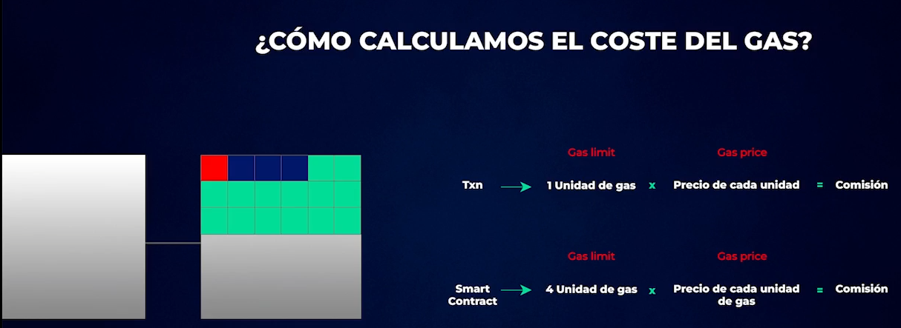
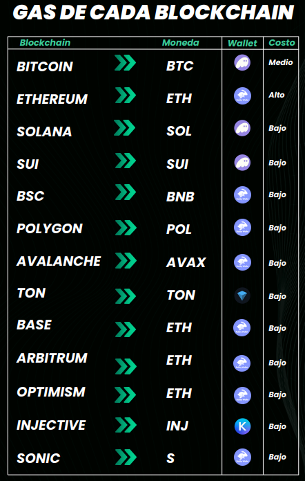

# El GAS y los EIP

Dijimos que cada Blockchain tiene su propia moneda nativa que es la utilizamos para pagarle a los validadores, en el
ejemplo de Ethereum tenemos el Ether. Siempre que querramos utilizar un smart contract necesitaremos aunque sea 0,0001
eth o menos de 1 centavo que es necesario para pagar el coste de ejecutar esos programas. La diferencia entre Ethereum
y Bitcoin, es que ETH tiene tambien su criptomoneda pero esa moneda no busca ser dinero, si no que busca ser una moneda
para pagar el uso de su infraestructura. Un ethereum equivale a 1 con 18 ceros wei. El wei es la unidad de medida mas
chica de ethereum, que es como el satoshi en bitcoin. El mas importante es el Gwei que se utiliza para medir el costo
que vamos a pagar por hacer una transaccion.

## ¿Que es el Gas?

Es el espacio que necesita una transaccion o contrato para poder existir dentro de la blockchain. Siempre hay que
pagarlo, incluso si la transaccion falla.

## ¿Por que sube?

Si pensamos en btc tambien pagamos una comision que depende de la cantidad de gente que quiere hacer una transaccion en
ese momento. Por ejemplo, sabemos que en btc guardamos unas 3000 transacciones por bloque y si hay 9000 transacciones
que quieran entrar en el proximo bloque va a ver 6000 que van a quedar afuera, entonces ¿Como haces para que tu
transaccion sea de las primeras que seleccionen? Pagas una comision mas alta. En ethereum es muy similar pero tienen
algunas diferencias, como ademas de transacciones tenemos smart contracts, no todos son envios de monedas. Aca se firman
smart contracts, por lo tanto se miden en MB. Cada bloque de ethereum tiene 1 MB aprox, digamos que se aprueban bloques
cada unos 15 segundos lo que representa un total de 4mb por minuto. Entonces si en 1 minuto quieren entrar mas
transacciones o firmas de smart contracts debes pagar un coste superior para que acepte tu transaccion de ante mano.

## ¿Como calculamos el coste del Gas?

La cantidad de tarifa que debemos pagar depende del precio del Gas y de la cantidad de espacio que necesitemos.
Basicamente el gas es el coste de una transaccion, y el coste se determina en funcion del espacio que necesitas.

Siempre va a ver una comision. Las nuevas blockchain de "tercera generacion" son mas economicas (comisiones de centavos)
y baratas aunque tengan gran demanada. Tambien de esto surgen las **propuestas de mejora (EIP, SIP, HIP)** ya que las
blockchain son de codigo abierto y por lo tanto cualquier desarrollador puede hacer una propuesta de mejora en la red.
Una de las propuestas de mejora importante en la red de Ethereum fue la EIP 1559 (https://eips.ethereum.org/all), ya
que permitia que las comisiones que se cobraban dentro de la blockchain se puedan dividir en dos partes, en donde ahora
pages una comision base minima llamada base-fee y la otra parte que es como una comision adicional conocida como
priority-fee que es la ganancia del validador. La base-fee se quema, es decir que va a un smart contract que hace
desaparecer los tokens. Esto hace que el precio de Ethereum aumente ya que cada vez hay menos oferta en circulacion, es
decir que cuanto mas uso tenga la red, mas comisiones se van a pagar y de esas comisiones una parte se va a estar
quemando constantemente. De esta forma ethereum pasa a ser deflacionario, no limitado como bitcoin si no que es
deflasionario. La pagina ultrasound.money muestra el supply de ethereum.

