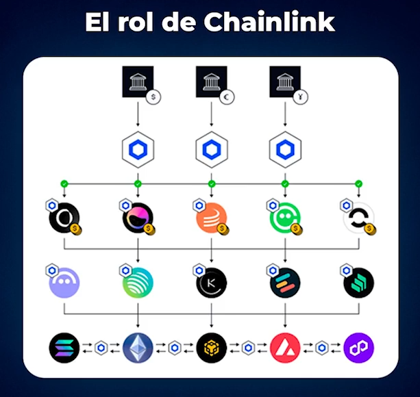

# Oraculos

Un oraculo en la mitologia es alguien que **te dice la verdad o que te predice el futuro**.

Imagina que en la blockchain se programo un smart contract de un seguro de vuelo, y ese smart contract esta configurado
para que si el avion llega 5 min tarde ese smart contract se auto ejecuta y a vos te devuelven el dinero al momento.
Para que esto pase, alguien le tiene que decir el horario del smart contract ¿por que como sabe a que hora llega el
avion? Dentro de la blockchain no existe el tiempo, no existe el horario, no sabe nada, ¿Entonces quien le da esa
informacion? El oraculo. **El oraculo es el componente que filtra informacion del mundo real hacia la blockchain**.
Esto es importante, por ejemplo si necesito un smart contract que sirve para realizar prestamos, ese smart contract
tiene que saber el precio del activo que estas dejando de colateral para pedir esa deuda.

Hay varios tipos de oraculos, los oraculos descentralizados como Chainlink ($Link) que tiene tu token Link que es una
moneda que sirve para comprar informacion descentralizada. Los smart contract de DeFi para saber el precio de Ethereum
se lo preguntan a Chainlink, y gracias a que Chainlink tiene datos descentralizados hay 10000 personas que dan un dato
y la media de esos datos es la verdad (si alguien dice la mentira se le quita el dinero). Esto es un sistema de consenso
muy similar al que utilizan las blockchains, en este caso Chainlink lo hace para recibir datos de muchos nodos, de
muchas personas y brindarselo a los smart contracts.

Un dato interesante, fue que en febrero del 2023 por el hackeo de un oraculo fueron robados 120 millones de dolares
en BonqDao. Un hacker manipulo el precio de un colateral lo que permitio pedir un prestamo sin devolverlo.

https://losslessdefi.medium.com/120m-attack-the-case-of-bonqdao-d71dbd13fbe

Los oraculos son un punto crucial en crypto y moveran trillones de dolares. Cuando hagamos la inversion, vamos a tener
oraculos si o si, por que es un componente que es responsable de darle informacion a todos los smart contracts de la
blockchain, y toda la estructura para poner datos dentro de estos smart contracts se llaman oraculos.

## ¿Por que es importante tener oraculos?

Para que una empresa pueda adoptar la blockchain, antes debe estudiar y analizar los riegos. Uno de los problemas es
tener oraculos centralizados que son faciles de hackear. Por eso tiene sentido que las empresas renuncien a esta
transicion.

## ¿Por que Chainlink?

Chainlink es una red de oraculos descentralizados. Cada oraculo entrega datos: precios, climas, escrituas, etc. Para
defraudar habria que manipular miles de oraculos, no uno solo.

## ¿Para que nos sirve entenderlo?

Invertir sin entender -> te volves un robot que sigue lo que dicen en YouTube. Si entiendo que son los oraculos, se que
tengo un activo con verdadero valor.

https://defillama.com/oracles

