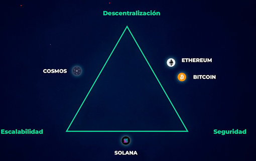

# El Trillema de la Blockchain

Cuando creamos una Blockchain el diseño que usemos tiene una influencia muy grande o consecuencia muy grande en el
futuro de esa blockchain, porque cuando creamos una blockchain hay un problema fundamental que tiene esta tecnologia que
es conocido como el **El Trillema de la Blockchain**. Cuando creamos una blockchain tenemos que elegir dos de tres
caracteristicas muy importantes: descentralizacion, seguridad y escalabilidad.

## ¿Que es la escalabilidad?

La escalabilidad se define como la velocidad que es capaz de asumir una blockchain sin saturarse. Por ejemplo, instagram
es escalable por que funciona igual de bien con 100 o un millon de usuarios. Cuando hablamos de bitcoin no tiene esa
particularidad, porque si ahora todo el mundo empieza a usar bitcoin la red se va a empezar a saturar ya que en bitcoin
solo se pueden hacer un maximo de 5 o 6 transacciones por segundo, no puede mas que eso. Con Ethereum lo mismo, cuando
mas gente hay la red se vuelve cara, dificil de usar y se vuelve lenta.

## ¿Que es el Trilema?

Cuando se diseña una blockchain, hay que elegir 2 o 3 caracteristicas.

La **descentralizacion** se entiende como el objetivo de que la blockchain no dependa de un punto central ya que el
espiritu de la blockchain **es que no sea un individuo, una empresa o un grupo que tenga el poder**. **Elimina
intermediarios** que generan, corrupcion o friccion. Entre **mas nodos, mas descentralizacion**, pero la ventaja de esto
es que **requiere mas consumo** energetico lo cual reduce la velocidad.

La **seguridad** es la habilidad de una blockchain para resistir ataques sin caerse ni detenerse. Cuanto **mas
descentralizada es una red mas segura se vuelve**. En el PoS se mide por el valor bloqueado en staking, y cuanto mas
valor, mas robusta la red. En el PoW se mide por la tasa de hash (fuerza computacional). Una tasa de hash mas alta es
igual a mas segurida.

La escalabilidad se define como la velocidad que es capaz de asumir una blockchain sin saturarse. Instagram es escalable
porque funciona igual con 100 - 100 millones de usuarios. Bitcoin no es escalable ya que tiene un maximo de 5 o 6 tx/s.
Ethereum tampoco es escalable porque cuanta mas gente hay, mas cara es la red, por lo tanto es mas dificil de usar y
mas lenta se vuelve. Escalable seria si pueden entrar millones de usuarios y que sigua yendo rapido, que tenga costes
bajos y experiencia igual de buena.

Estos son los tres factores, descentralizacion, seguridad y escalabilidad. En el fondo no pueden ser los 3 juntos porque
para que una blockchain sea super rapida, super descentralizada y super segura, tiene que ir sacando de otro lado.

## Principales blockchains que buscan resolver esto

Lo mas importante es que una blockchain tiene que ser **descentralizada y segura**, esto va por encima de todo.