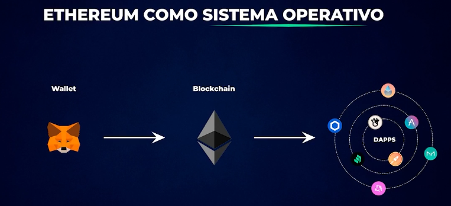
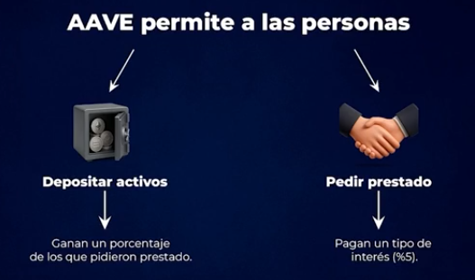
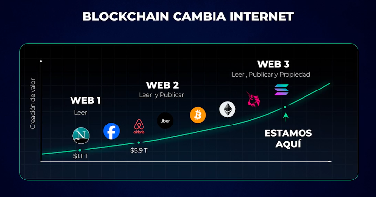

# Smart Contracts

Existen dos tipos de smart contracts: los ejecutables (**dapps** = aplicaciones descentralizadas) que sirven para
interactuar como aplicaciones (por ejemplo, intercambiar USDT por Bitcoins), y los que sirven para crear tokens.

Para entender las dapps, hay que compararlas con aplicaciones normales. Una aplicacion tradicional tiene un servidor con
backend (codigo) y frontend (interfaz), siendo un sistema centralizado donde la empresa gestiona peticiones y bases de
datos. Las dapps cambian esto gracias a Ethereum: el backend son smart contracts en la blockchain y el servidor actua
como frontend. El backend esta programado publicamente en **Solidity**, permitiendo que cualquiera vea el codigo fuente,
generando seguridad y transparencia. Las dapps estan alojadas en una blockchain distribuida mundialmente donde nadie
puede cambiar, borrar o censurar, se autoejecutan y ningun tercero puede interferir. Las dapps se ejecutan en una EVM, y
para usarlas en Ethereum se necesita pagar con Ether.

## Ejemplo de una Dapp

Unas de las aplicaciones descentralizadas mas utilizadas son [**Aave**](https://aave.com/) y
[**Uniswap**](https://app.uniswap.org/). Aave nos permite prestar dinero y pedir prestado, basicame es una web que no
hace falta registrarse si no que la forma de utilizar esta aplicacion es conectarte con una wallet al smart contract.
Para interactuar con Aave primero tenemos que ingresar a _Open App_ y luego a _Connect wallet_ donde deberas elegir
la wallet especifica que quieras usar. Una vez conectada la wallet ya puede iniciar una interaccion con este smart
contract depositando Ether a un porcentaje anual, puedes tambien pedir prestado USDC a un porcentaje especificado. Una
de las funciones de Aave al ser EVM (estar dentro de Ethereum), fue replicarse en otras redes. Por ejemplo puedes elegir
la red de Arbitrum y elegir _Supply_, en donde ya estarias depositando capital dentro de Aave prestando tu dinero y
generando una rentabilidad.

Las aplicaciones descentralizadas generan ganancias (por ejemplo, Aave cobra un 1% de diferencia entre el interés que
paga a prestamistas y el que cobra a prestatarios). Sin junta directiva, ese dinero va a un token, que funciona como la
acción de la aplicación. Cada aplicación tiene su moneda (**uni** para Uniswap, **aave** para Aave) que absorbe el valor
generado. Aave, por ejemplo, usa sus ganancias semanales para comprar ETH y distribuirlo entre quienes tienen tokens
aave depositados, además de hacer recompras de su moneda. Los holders del token también pueden proponer y decidir
mejoras en la aplicación. En resumen, cada aplicación tiene su moneda que absorbe el valor generado. Esto es la Web 3.0.

