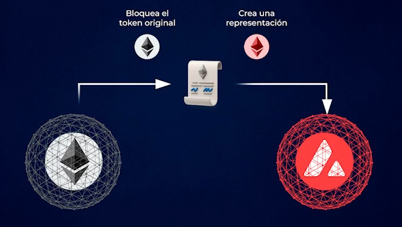

# Bridge y Router

Es importante saber como moverse entre estas blockchains para trabajar en un ecosistema multicadena (ecosistema de
varias blockchains). Hay que recordar que cada blockchain tiene sus propios smart contracts y tiene sus propias monedas
o tokens, por lo tanto es necesario que en ciertas ocasiones necesitemos ir de etherum a Avalanche. Tal vez yo quiero
usar un smart contract que solo este en Avalanche, porque ese smart contract me esta dando una mayor rentabilidad o por
que quiero pedir un prestamo y es mas barato, o por que es mas seguro y genero lo mismo. Entonces, tal vez yo tengo
mi dinero en la red de ethereum y quiero ir a Avalanche ¿entonce como hago para llegar a Avalanche? para eso se
utilizan los bridge.

## ¿Que es un Bridge?

Un Bridge es un Smart Contract que conecta dos blockchains.

En el medio de estas dos blockchains hay un smart contract al que yo le envio mis fondos por la red de ethereum y este
smart contract va a bloquear esos ether en la red de ethereum y va a crear en la red de Avalanche una representacion.
Esto lo hace porque ethereum no puede ir de una red a otra, la moneda ether solamenete existe en la red de ethereum. Por
lo tanto lo que hace un smart contract es bloquear esos ethereum nativos en su propia red y va a emitir otro smart
contract vinculado al mismo equipo, es decir va a emitir una representacion que se puede llamar wEthereum en la red de
Avalanche que va a valer un ethereum porque hay un ethereum real bloqueado en su propia red. Este proceso de bloquear y
crear, justamente cuando se crea un token se llama minting, el minteo es la crecion de un token en blockchain. Este
mismo proceso de bloque y creacion es lo que permite que podamos tener ethereum o muchas otras monedas en muchas redes
porque el nativo queda bloqueado en la red original y se crean representaciones. Esto lo vamos a poder utilizar para
poder ir de ethreum a solana, de solana a cardano, es mucho mas simple porque lo trabajas con la misma wallet. Como vos
tenes todas las redes EVM dentro de la wallet de Rabby, va a ser mas barato y lo vas a poder hacer todo en el mismo
sitio. Pero cuando queres ir entre redes que no son EVM, como por ejemplo de Ethereum a Solana, justamente ahi tenes que
usar dos wallets, por ejemplo en Rabby vas a tener los ether en la red de ethereum y vas a tener que recibir esas
monedas que quieras recibir en otra wallet que sea compatible con solana, por ejemplo Panthom.

Si yo quiero mover bitcoins de su red nativa, tal vez a la red ethereum por que lo quiero usar en DeFi, porque esos
bitcoins que tengo lo quiero usar de colateral o quiero aportar liquidez con esos btcs, justamente necesito sacarlos
de la red de bitcoin, necesito tener una representacion, por lo tanto aca entra en juego el bridge. Al final el bitcoin
no se transfiere si no que se bloquea en su red nativa y se crea una representacion. La representacion habitualmente
se llama wBitcoin (wrappedBitcoin) que se puede utilizar en la red de ethereum. Despues cuando queres volver al bitcoin
nativo, lo que haces es enviar ese wBitcoin a un smart contract el cual va a quemar esa moneda y va a liberarte el
bitcoin nativo en la red original ¿Por que se quema? porque ya pierde esa paridad 1 a 1 ya que el otro va estar
liberado, por lo tanto ese bitcoin ya no va a valer 1 btc. Asi funciona el bridge en todas las redes. Estos proyectos a
ido evolucionando, y aparece una nueva tecnologia llamada **Router**.

## ¿Que es un Router?

Es un smart contract que en vez de tener que bloquear y crear una representacion, tiene como una boveda de usdt (u otras
monedas) en muchas redes. Entonces yo le puedo enviar usdt en la red de ethereum y simplemente el va a agarrar usdt
que ya los tiene en la red de polygon y me los va a enviar a mi propia wallet. Aca no hay ningun bridge, yo no bloqueo
el dinero y creo usdt en otra red. Simplemente yo le doy dinero en una red y el me lo va a liberar en otra. Esto hace
que sea mas economico porque a nivel de gas en la blockchain es mucho mas barato, hacer una trasaccion de envio y otra
de envio hacia la otra wallet, que es lo que te puede costar bloquear una moneda y emitir una moneda nueva.

Hay varias alternativas para poder trabajar con esto, una opcion mas simple pero centralizada es utilizar los CEX como
bridge, por ejemplo Binance.

