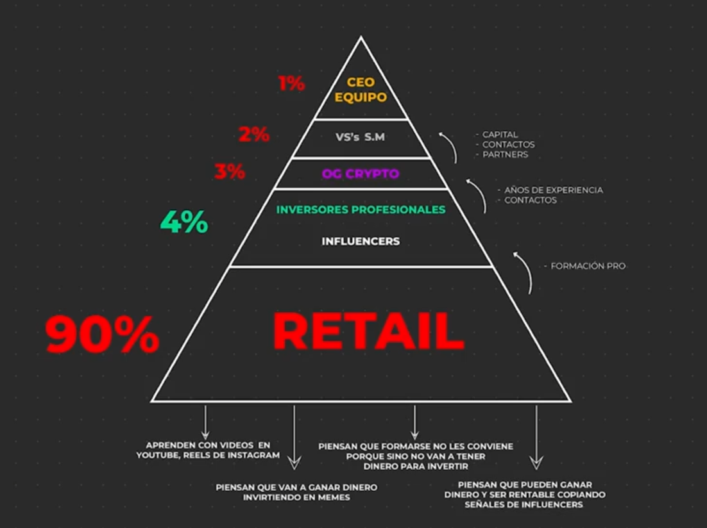

# Mentalidad a la hora de invertir

Tu mentalidad determina cuales van a ser tus acciones, y tus acciones determinan cuales van a ser tus resultados.

## La piramide de la informacion

1. Quien es tu competencia: Tenes que entender contra quien estas compitiendo, porque para que vos ganes dinero alguien
   tiene que perder.
2. La importancia de la informacion: Cuanto mas informacion tengas mas dinero vas a hacer porque te vas a anticipar a
   los otros jugadores del mercado.
3. Creencias que te limitan: Entiende esas malas espectativas que van a ser tu anclaje y que van a impedir lo que
   viniste a buscar a etse mercado.

El **ratail** es el ultimo en enterarse de un proyecto, por lo tanto termina entrando tarde al mercado (cuando el precio
es muy alto) ya que mucha gente se posiciono primero, es decir los inversores profresionales, influecers y todas las
personas que estan por encima de la piramide. Cuando te llega la informacion por YouTube, esta informacion llega tarde
ya que pasaron horas o incluso dias. Entonces, los principales inversores que se posicionaron primero estan buscando
liquidez, y esa liquidez viene del retail, por eso se dice que el ratail es el **exit loquidity**, cuando los retail
compran todos los demas venden.

"El hacer dinero es tener sentido comun".

Si vas a estar en este mercado, tenes que adoptar la vision de generar riqueza a largo plazo.